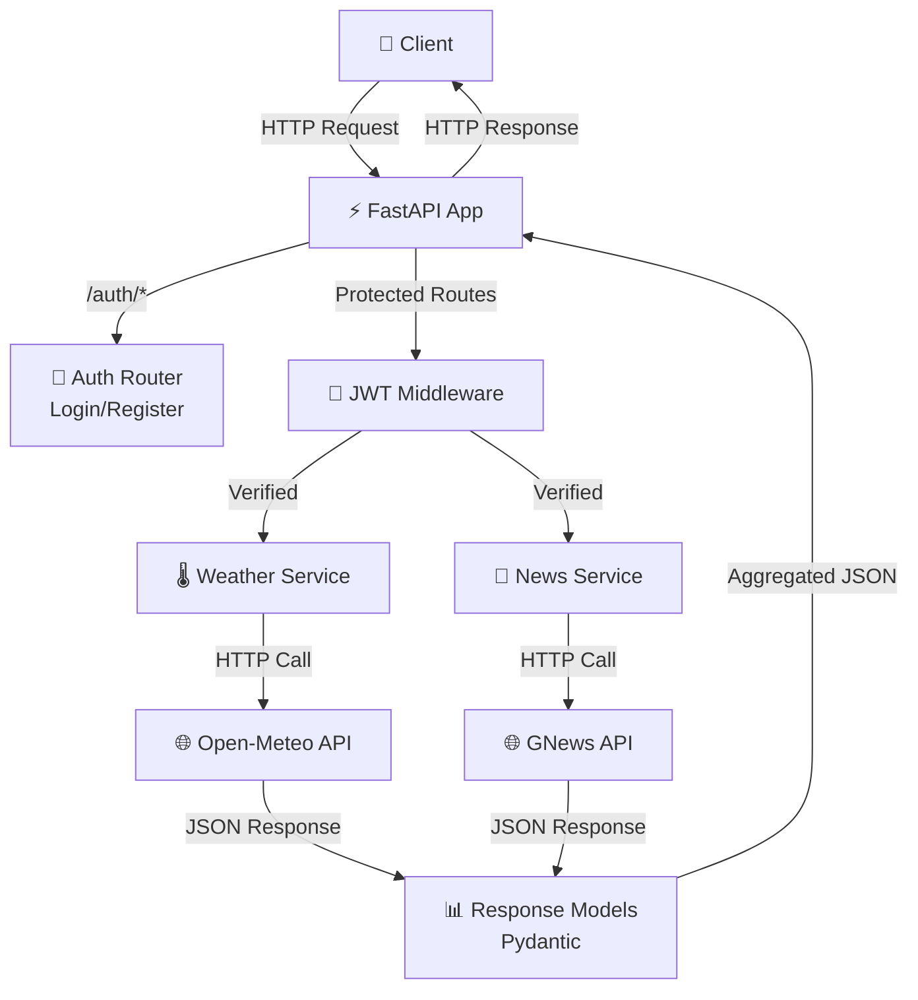
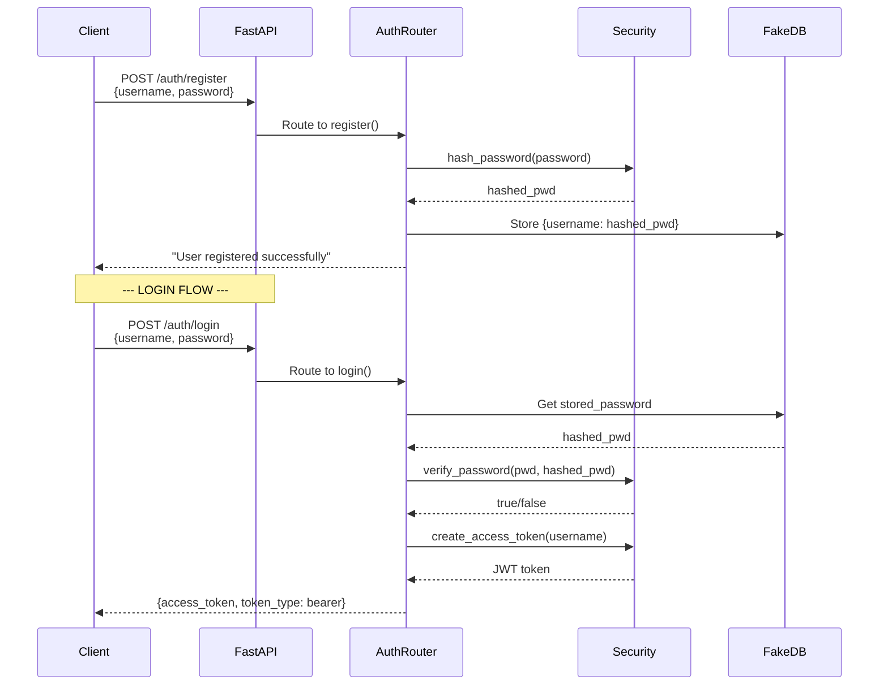
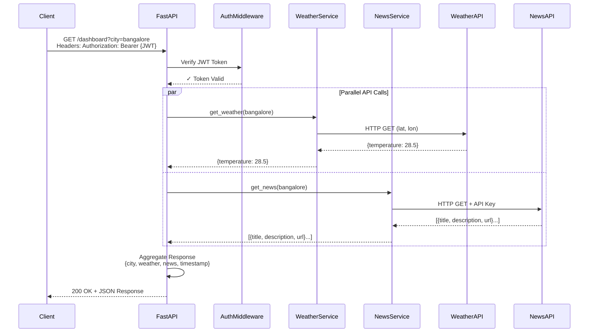

# API Integration Service

## Overview

A production-ready REST API service demonstrating **multi-source data aggregation**, **JWT authentication**, and **scalable integration patterns**. This service fetches and aggregates weather and news data for requested cities from external APIs, showcasing backend architecture and integration design principles.

### Why This Project?
This project demonstrates key architectural concepts for Integration/Solution Architect roles:
- **API Integration Patterns**: Aggregating data from multiple external services
- **Authentication & Authorization**: JWT-based token management
- **Async Architecture**: Non-blocking I/O for better concurrency
- **Separation of Concerns**: Modular service design (auth, services, models, config)
- **Configuration Management**: Environment-based secrets and settings

## Features

- 🔐 **JWT Authentication**: Secure register/login endpoints with bcrypt password hashing
- 🌍 **Multi-Source Data Aggregation**: Combines weather data (Open-Meteo) and news articles (GNews)
- 📊 **Dashboard Endpoint**: Single aggregated response for city data
- ⚡ **Async/Await**: Non-blocking HTTP calls using httpx
- 📝 **Pydantic Validation**: Strong type hints and request/response validation
- 🔧 **Environment Configuration**: Secure API key management via `properties.env`

## Architecture

### System Architecture Diagram



### Authentication Flow Diagram



### Data Aggregation Sequence Diagram



### Design Decisions

| Decision | Rationale |
|----------|----------|
| **FastAPI** | Async-first framework with automatic OpenAPI documentation; ideal for I/O-bound integrations |
| **Async/Await** | Non-blocking I/O with httpx for concurrent external API calls |
| **Pydantic Models** | Type-safe request/response validation and automatic OpenAPI schema generation |
| **JWT Auth** | Stateless authentication; no session storage needed; scalable for microservices |
| **Separate Services** | Modular design allows easy addition of new data sources (e.g., stock prices, weather alerts) |
| **Environment-Based Config** | Secure handling of API keys; supports multiple deployment environments |

## Project Structure

```
api-integration-service/
├── app/
│   ├── main.py                 # FastAPI app initialization, route mounting
│   ├── auth/
│   │   ├── routes.py          # Login/Register endpoints
│   │   ├── security.py        # Password hashing, JWT token creation/verification
│   │   └── dependencies.py    # Dependency injection for authentication
│   ├── services/
│   │   ├── weather_service.py # Open-Meteo API integration
│   │   └── news_service.py    # GNews API integration
│   ├── models/
│   │   └── dashboard.py       # Pydantic response models
│   └── config/
│       └── settings.py        # Configuration management (BaseSettings)
├── properties.env              # API keys and secrets (git-ignored)
├── requirements.txt            # Python dependencies
└── README.md                   # This file
```

## Quick Start

1. Create and activate a Python virtual environment:

```bash
python -m venv venv
source venv/bin/activate
```

2. Install dependencies:

```bash
pip install -r requirements.txt
```

3. Add your API keys in `properties.env` (repo root):

```
gnews_api_key="your_gnews_api_key_here"
weather_api_key="your_openweather_api_key_here"
```

4. Run the app with Uvicorn:

```bash
uvicorn app.main:app --reload --host 127.0.0.1 --port 8000
```

5. Access Swagger UI documentation:

```
http://localhost:8000/docs
```

## API Endpoints

### Authentication

| Method | Endpoint | Description | Request Body |
|--------|----------|-------------|---------------|
| `POST` | `/auth/register` | Register a new user | `{"username": "...", "password": "..."}` |
| `POST` | `/auth/login` | Authenticate and get JWT token | `{"username": "...", "password": "..."}` |

**Response:** `{ "access_token": "<jwt_token>", "token_type": "bearer" }`

### Data Integration

| Method | Endpoint | Description | Authentication |
|--------|----------|-------------|----------------|
| `GET` | `/` | Health check | Not required |
| `GET` | `/weather?city=<city>` | Get current temperature | Optional |
| `GET` | `/dashboard?city=<city>` | Get aggregated weather + news | Bearer Token |

**Example Response (`/dashboard?city=bangalore`):**
```json
{
  "city": "bangalore",
  "weather": { "temperature": 28.5 },
  "news": [
    {
      "title": "...",
      "description": "...",
      "url": "..."
    }
  ],
  "timestamp": "2024-01-15T10:30:00Z"
}
```

## Configuration

- **Supported Cities** (case-insensitive): `bangalore`, `mumbai`, `delhi`. Unknown cities default to `bangalore`.
- **API Keys**: Load from `properties.env` via `config/settings.py` (Pydantic BaseSettings)
- **Environment Variables**: Can also export `gnews_api_key` and `weather_api_key` in shell

## Known Limitations & Future Improvements

### Current Design (MVP Focused)
- 📌 Synchronous API calls - straightforward error handling and request/response flow
- 📌 Direct service calls - minimal latency for small-scale aggregation
- 📌 Simple authentication model - easy to understand JWT flow for learning/demo purposes
- 📌 Lightweight footprint - no external dependencies like Redis or message queues
- 📌 Focused scope - core integration patterns without enterprise complexity

### Planned Enhancements (Priority Order)
1. **Resilience Patterns**: Implement retry logic with exponential backoff and circuit breaker pattern
2. **Response Validation**: Add Pydantic models for external API responses
3. **Caching Layer**: Redis-based caching with TTL for aggregated data
4. **Structured Logging**: Request/response logging with correlation IDs for tracing
5. **Rate Limiting**: SlowAPI-based per-user rate limiting
6. **Comprehensive Testing**: Unit tests for services, integration tests with mocked APIs
7. **API Versioning**: Support `/v1/`, `/v2/` endpoints for backward compatibility
8. **Monitoring**: Prometheus metrics and health check endpoints
9. **Async Background Tasks**: Celery integration for long-running aggregations
10. **Security Hardening**: Input validation, SQL injection prevention, CORS configuration

## Running Tests

```bash
# Coming soon: pytest integration tests
pytest tests/ -v
```

## License

MIT License
